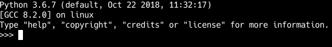

# Installasi Python di Windows
Saat ini terdapat dua versi python yang masih beredar yaitu versi 2.x dan versi 3.x.
Namun begitu pada tutorial ini kita hanya akan menggunakan versi 3.x. Hal ini dikarenakan
versi 2.x akan berhenti supportnya pada tahun 2020.

Langkah awal untuk installasi adalah mengunduh file instalasi Python di [https://www.python.org/downloads/windows/](https://www.python.org/downloads/windows/).

Untuk versi Windows 32bit silahkan unduh versi Python yang x86 sedangkan untuk yang 62bit silahkan unduh yang x86_64

Setelah file instalasi terunduh maka silahkan eksekusi file tersebut kemudian ikut instruksi di dalamnya.

Apabila instalasi telah berjalan dengan baik dan benar maka kita dapat memanggil Python dari CMD Windows. 

Ketikan `python` di CMD masing - masing, perintah ini akan memanggil Read Eval Print Loop ( REPL ) dari Python.
Di sini kita bisa mengetikan perintah untuk kemudian di eksekusi oleh Python. Akan muncul seperti gambar di bawah ini

